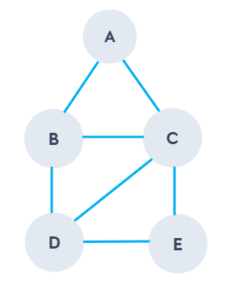

# Graph 圖

Graph資料結構主要用來記錄關聯、關係，並由數個vertex(節點)與edge(線段)組成，其中edge又可分為有有像或是無向兩種。

Graph表示

G = (V, E)

G: 圖形

V： 所有節點(vertex)集合

E: 所有線段(edge)集合，一個線段由兩個vertex組成，EX(A, B)、(B, E)

下面為一個Graph表示的範例

```
G =[
    [ A, B, C, D, E ],  
    [ 
        [A, B], [A, C], [B, C], [B, D], [C, D], [C, E], [D, E]
    ]
]
```



## 無向圖

在圖形中每條邊(edge)都是沒有方向，則該圖則為無向圖。其中用[V<sub>i</sub>, V<sub>j</sub>]來表示圖形中的一條邊
，而因為在無向圖中的邊是沒有起點與終點的，所以[V<sub>i</sub>, V<sub>j</sub>]與[V<sub>j</sub>, V<sub>v</sub>]表示圖形中的銅一條邊。

在無向圖中，如果任意兩個節點中間都存在邊，則該圖為無向完全圖。

## 有向圖

與無向圖相反，若中每條邊(edge)都是有方向，則該圖則為有向圖。一樣透過[V<sub>i</sub>, V<sub>j</sub>]來表示圖形中的一條邊，其中V<sub>i</sub>為該條邊的起點，而V<sub>j</sub>為終點

在有向圖中，如果任意兩個節點之間有互相相反方向的邊，則該圖為有向完全圖。

## 遍歷

### BFS

可以透過佇列方式實現

```go
func (g *Graph) Traverse() []string {
    var data []string
    q := NewQueue()
    head := g.Vertex[0]
    q.Enqueue(*head)

    visited := make(map[*Node]bool)
    visited[head] = true

    for {
        if q.IsEmpty() {
            break
        }
        
		node := q.Dequeue()
        visited[node] = true
        nNodes := g.Edges[*node]
        
		for _, next := range nNodes {
            if visited[next] {
                continue
            }
            q.Enqueue(*next)
            visited[next] = true
        }

        data = append(data, node.Val)
    }

    return data
}
```

### DFS

可以透過堆疊方式實現

```go
func (g *Graph) DFS() []string {
	var data []string
	q := NewStack()
	head := g.Vertex[0]
	q.Push(*head)

	visited := make(map[*Node]bool)
	visited[head] = true

	for {
		if q.IsEmpty() {
			break
		}
		node := q.Pop()
		visited[node] = true
		nNodes := g.Edges[*node]
		for _, next := range nNodes {
			if !visited[next] {
				q.Push(*next)
				visited[next] = true
			}
		}

		data = append(data, node.Val)
	}

	return data
}
```