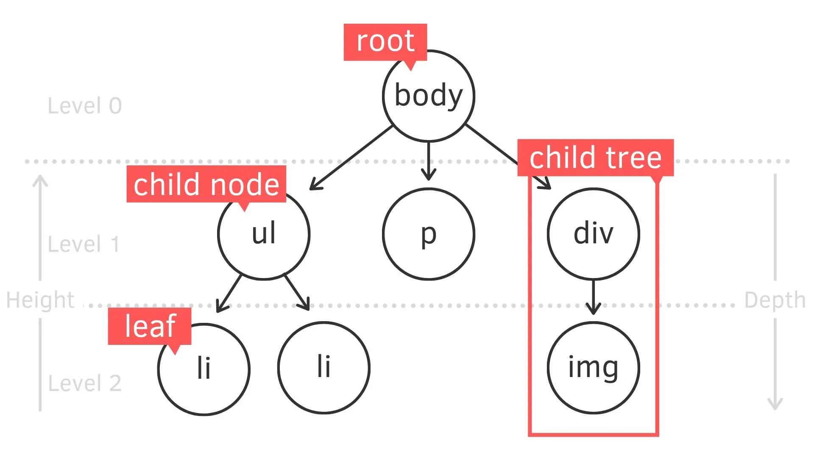
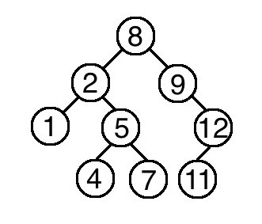

# Tree

一種階層架構的非線性資料結構，最近幾年中很火樂的人工智慧中的核心概念決策樹就是一種tree的應用。

1. 根節點：一個樹最上層的節點，一個樹只會有一個根節點(root)。
2. 樹葉節點：樹中最底層的節點，沒有任何下屬節點。
3. 子樹：子節點與其下所屬所有子節點則為。
4. 樹的深度：從根節點到樹葉節點高度。
5. 兄弟節點：擁有共同父節點的節點，EX: ul、p與div為兄弟節點。
6. 祖先節點：某節點到根節點之間所經過的所有節點，皆為該節點的祖先節點。
7. 分支度：每個節點擁有的子節點數EX: body的分支度為3。

樹主要透過Linked List進行實作

## 遍歷

1. 後序遍歷：先印出左節點，接著是右節點，最後才是根節點
2. 中序遍歷：一樣印出是左節點，接著根節點，最後才是右節點
3. 前序遍歷：先印出根節點、接著左節點、最後才是右節點

## 二元樹(Binary Tree)

每個節點最多只有二個子節點，則該樹則可稱為二元樹

## 二元樹搜尋樹(Binary Search Tree)

又稱為排序二元樹或有序二元樹，且具有以下特點

1. 左子樹上所有子節點的值均小於它的根節點的值
2. 右子樹上所有子節點的值均大於它的根節點的值
3. 任意節點形成的樹也依一定為二元搜尋樹
4. 樹中的節點得值一定部會相同

### 新增節點

因為二元樹搜尋樹是有序的，所以當要插入一個節點時都需要去與目前所在節點比較，如果大於則往右子樹走，反之則往左子樹走。

EX: 假設要在上面範例二元樹搜尋樹插入一個值為`0`的節點

step 1. 從根節點開始，`0`小於根節點值`8`，所以接下來要往左子樹走。

step 2. 根節點的右子樹的節點為值`2`，而`0`小於該值，所以一樣往左子樹走

step 3. `0`小於`1`，且由於節點`1`的左右子節點皆為空，所以可以知道其為一樹葉節點，所以可以將節點`1`的左節點設為節點`0`